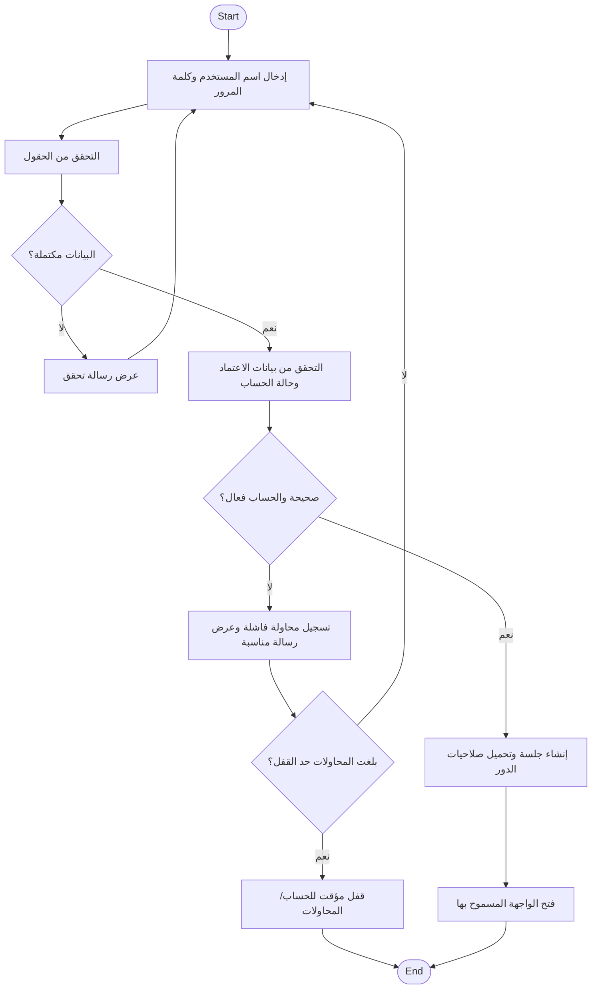
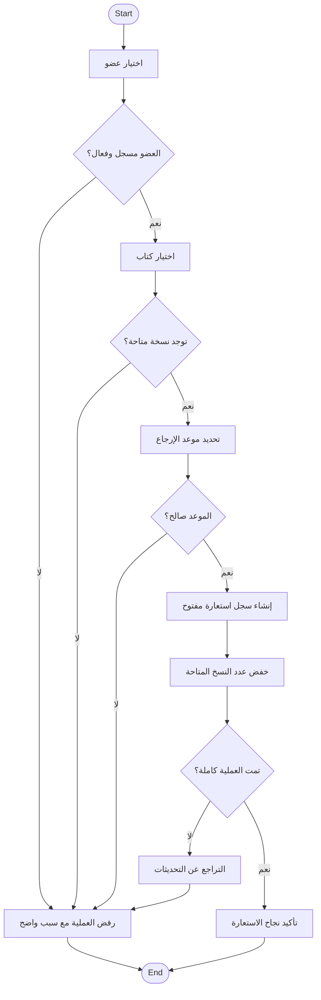
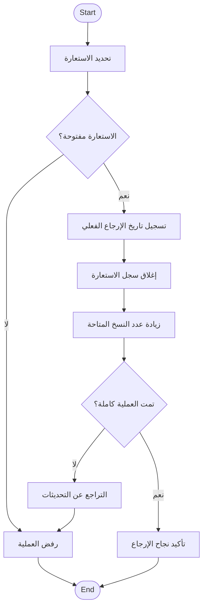
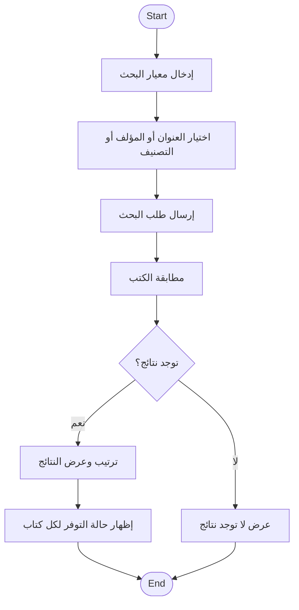

# Activity Diagrams

## 1. نشاط تسجيل الدخول

## 2. نشاط استعارة كتاب

## 3. نشاط إرجاع كتاب

## 4. نشاط البحث عن كتاب

## قواعد التحليل

- الاستعارة والإرجاع لا ينفذهما Member.
- نجاح الاستعارة أو الإرجاع يتطلب اكتمال تحديث سجل Loan وتوفر الكتاب كوحدة منطقية واحدة.
- البحث متاح حسب صلاحية المستخدم ويعرض حالة التوفر.
