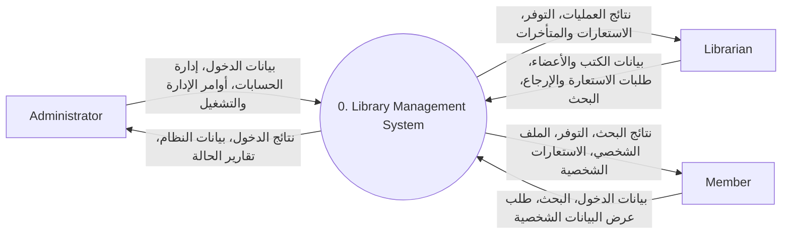
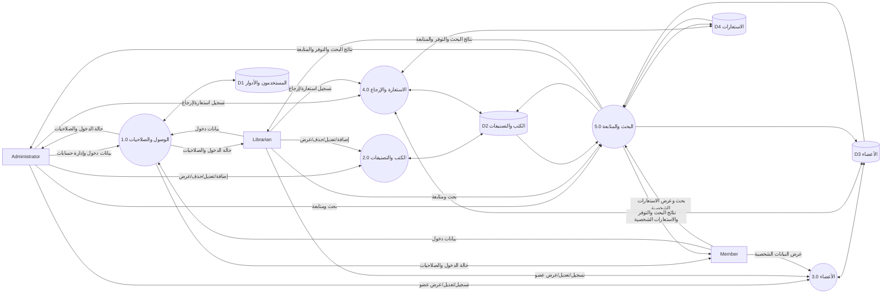

# Data Flow Diagrams (DFD)

## 1. Context Diagram / Level 0

يعرض النظام كعملية واحدة ويتعامل مع الجهات الخارجية الثلاث.

## 2. DFD Level 1

يتم تفكيك النظام إلى خمس عمليات منطقية رئيسية وأربعة مخازن بيانات منطقية.

## 3. تعريف العمليات

| العملية | الوصف | المتطلبات الأساسية |
|---|---|---|
| 1.0 الوصول والصلاحيات | الدخول والخروج والحسابات والأدوار ومنع الوصول غير المصرح | FR-01..FR-07 |
| 2.0 الكتب والتصنيفات | إضافة وتعديل وعرض وحذف الكتب وإدارة التصنيفات | FR-08..FR-14 |
| 3.0 الأعضاء | تسجيل وتعديل وعرض العضو والملف الشخصي والسجل | FR-15..FR-19 |
| 4.0 الاستعارة والإرجاع | تنفيذ عمليات الاستعارة والإرجاع وتحديث التوفر | FR-20..FR-24 |
| 5.0 البحث والمتابعة | البحث والتوفر والاستعارات الحالية والمتأخرة | FR-25..FR-34 |

## 4. مخازن البيانات المنطقية

- **D1 المستخدمون والأدوار:** بيانات حسابات الدخول والأدوار والصلاحيات.
- **D2 الكتب والتصنيفات:** بيانات الكتب والتصنيفات وإجمالي النسخ والمتاح.
- **D3 الأعضاء:** بيانات أعضاء المكتبة وحالتهم.
- **D4 الاستعارات:** بيانات الاستعارة وموعد الإرجاع والإرجاع الفعلي والحالة.
