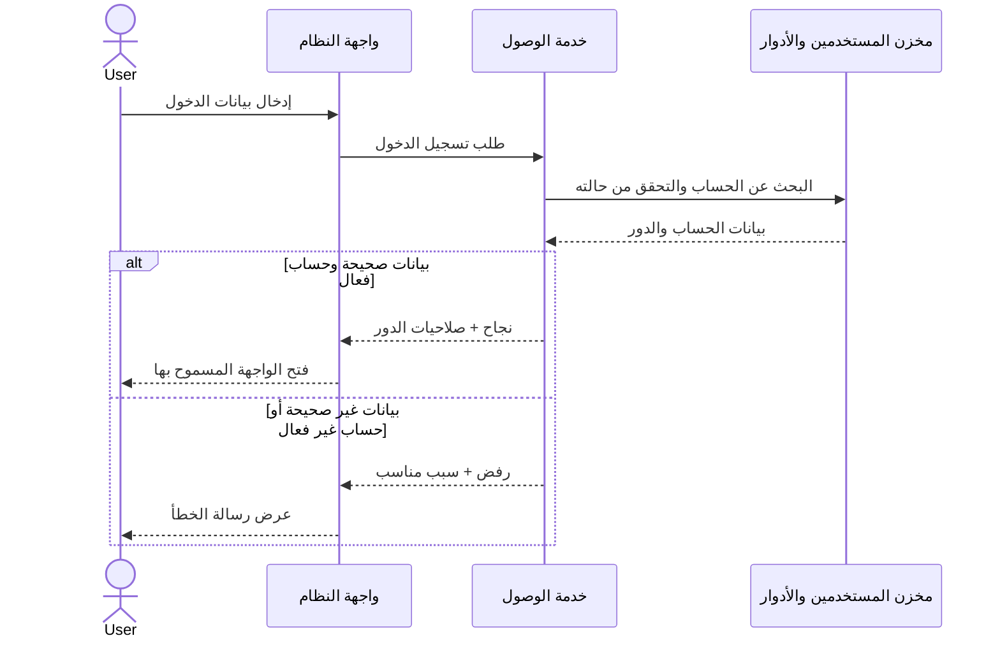
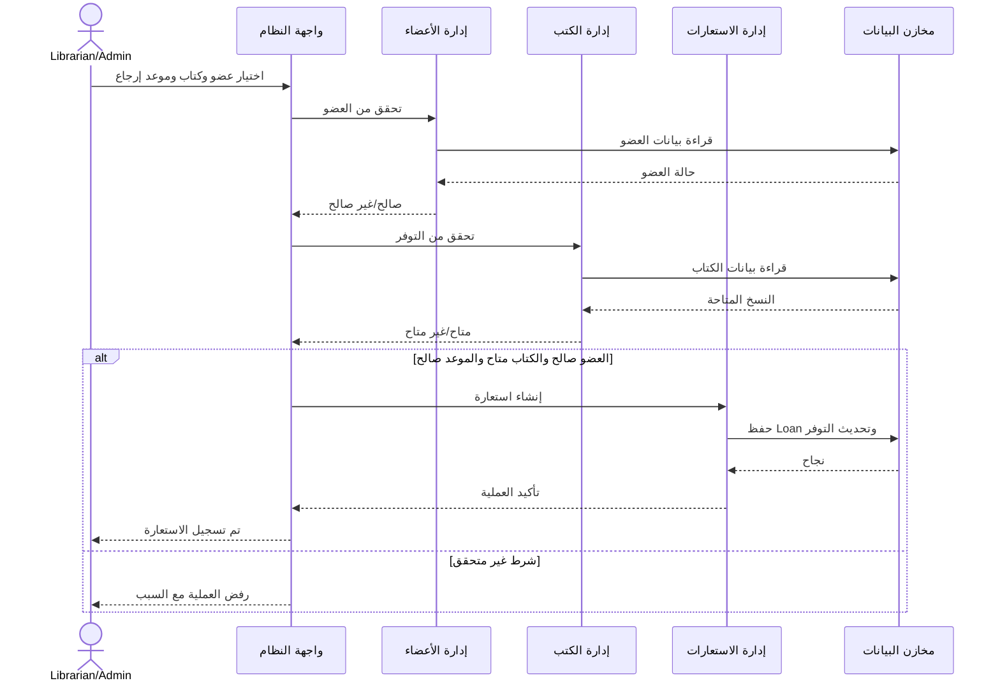
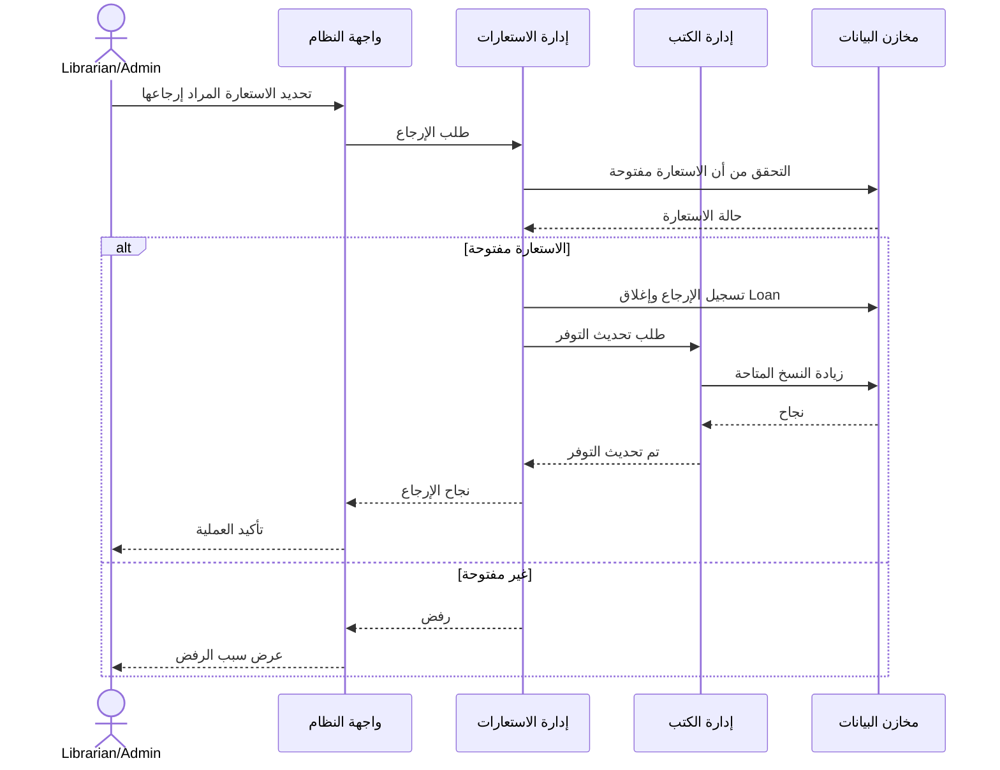
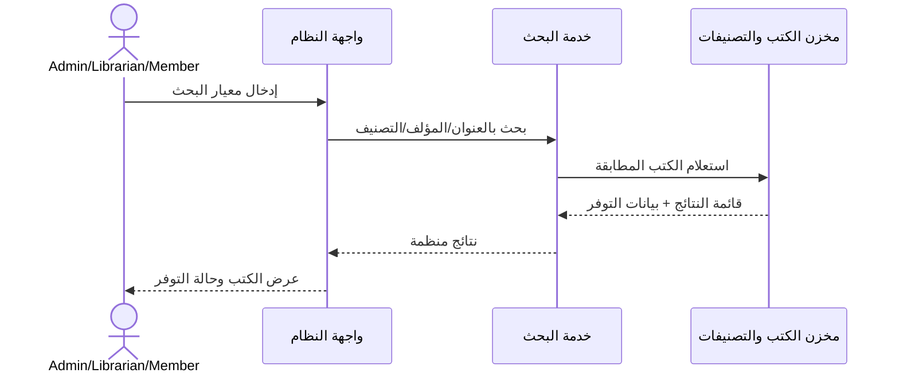

# Sequence Diagrams

> المشاركون هنا مكونات منطقية للتحليل وليست فرضًا نهائيًا على تقنية التنفيذ.

## 1. Sequence — تسجيل الدخول

## 2. Sequence — استعارة كتاب

## 3. Sequence — إرجاع كتاب

## 4. Sequence — البحث عن كتاب

## التغطية

| المخطط | المتطلبات |
|---|---|
| تسجيل الدخول | FR-01..FR-07 + NFR-03..NFR-06 |
| استعارة كتاب | FR-20, FR-21, FR-23 + NFR-09 |
| إرجاع كتاب | FR-22, FR-24 + NFR-09 |
| البحث عن كتاب | FR-25..FR-29 + NFR-01, NFR-07 |
