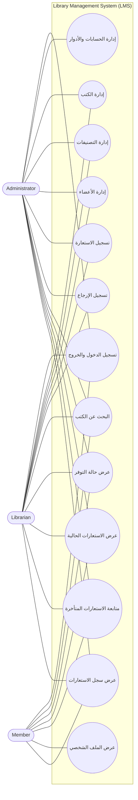

# Use Case Diagram — Library Management System

## الهدف

تمثيل التفاعل بين الممثلين الثلاثة ووظائف النظام الرئيسية وفق المتطلبات المعتمدة.

## وصف الممثلين

### Administrator
يمتلك صلاحيات Librarian بالإضافة إلى إدارة حسابات المستخدمين والأدوار والصلاحيات.

### Librarian
يدير الكتب والتصنيفات والأعضاء، ويسجل الاستعارات والإرجاعات، ويتابع الاستعارات الحالية والمتأخرة.

### Member
يسجل الدخول إلى حسابه الشخصي، ويبحث عن الكتب ويعرض التوفر وبياناته واستعاراته وسجله الشخصي فقط.

## تغطية المتطلبات

| Use Case | المتطلبات |
|---|---|
| تسجيل الدخول والخروج | FR-01..FR-03 |
| إدارة الحسابات والأدوار | FR-04..FR-07 |
| إدارة الكتب | FR-08..FR-11 |
| إدارة التصنيفات | FR-12..FR-14 |
| إدارة الأعضاء | FR-15..FR-19 |
| تسجيل الاستعارة | FR-20, FR-21, FR-23 |
| تسجيل الإرجاع | FR-22, FR-24 |
| البحث وعرض التوفر | FR-25..FR-29 |
| الاستعارات الحالية والمتأخرة | FR-30..FR-34 |
